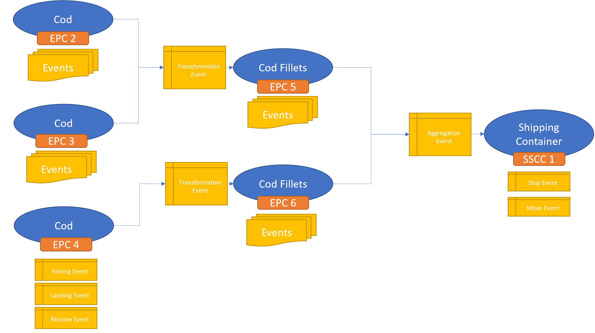

Performing trace-backs and trace-forwards is important in traceability.

# Trace-backs
A trace-back involves tracing a product to it's source-products. This can be done two ways. The first is by analyzing the transformation events in which a product was an output, collecting a list of the inputs, and then querying the EPCIS Query Interface for events relating to the inputs. The second is by analyzing the aggregation events with the action set to ADD in which an EPC is the parent, collecting a list of the children, and then querying the EPCIS Query Interface for events relating to those children.

## Step 1
We will start with ***SSCC 1*** in this scenario. The first step will to be to query the EPCIS Query Interface for all events pertaining to ***SSCC 1***.

## Step 2
Scan for all transformation or aggregation events returned in step 1. Make a list of all unknown inputs and children. Then query the EPCIS Query Interface for all events pertaining to each input.

> In this exercise, we would find an Aggregation-ADD event in which ***SSCC 1*** is the parent and contains two chilren. This would be ***EPC 5*** and ***EPC 6***. We would then query the EPCIS Query Interface for all events relating to those children.

## Step 3
Repeat step 2 until no unknown inputs/children are left in the gathered event set. 

> In this exercise, this would be repeated one time for ***EPC 2***, ***EPC 3***, and ***EPC 4***. We would find transformation events in which the outputs are ***EPC 5*** or ***EPC 6*** and then see that their inputs are ***EPC 2***, ***EPC 3***, and ***EPC 4***. Which means we can now query the EPCIS Query Interface for all events relating to those inputs.

# Trace-forwards
A trace-forward involves tracing a product to it's parent products. This can be done in two ways. The first is by analyzing the transformation events in which a product was an input, collecting a list of the outputs, and then querying the EPCIS Query Interface for events relating to the outputs. The second is by analyzing all aggregation events where the action is set to ADD, collecting a list of all parent IDs, and then querying the EPCIS Query Interface for events relating to those parents.

## Step 1
We will start with ***EPC 4*** in this scenario. The first step will to be to query the EPCIS Query Interface for all events pertaining to ***EPC 4***.

## Step 2
Scan for all transformation and aggregation-ADD events returned in step 1. Make a list of all unknown outputs or parents. Then query the EPCIS Query Interface for all events pertaining to each output/parent.

> In this exercise, this would be ***EPC 6***

## Step 3
Repeat step 2 until no unknown outputs/parents are left in the gathered event set.

> In this exercise, this would be ***SSCC 1***