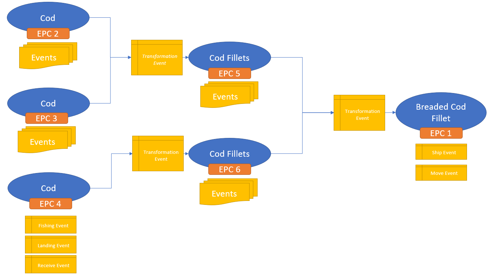

> For the purpose of this explination, ***EPC 1*** in the illustration above will be *urn:gdst:example.org:product:lot:class:company01.itemcode01.lot01*

Step 2 will have turned the Transformation Event that had EPC 1 (urn:gdst:example.org:product:lot:class:company01.itemcode01.lot01) as an output, and will contain two input EPCs. 

Step 3 is 