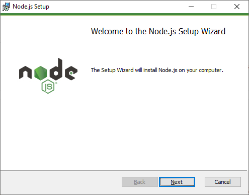
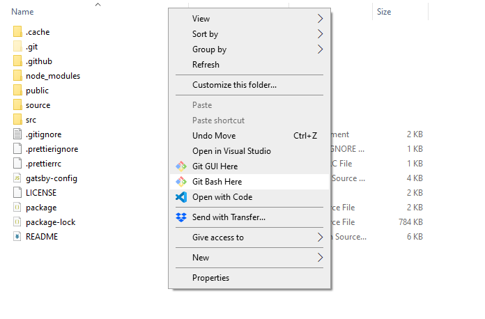
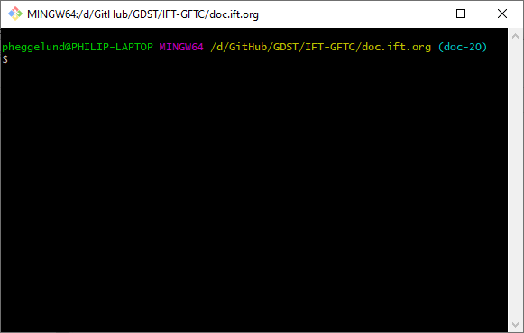
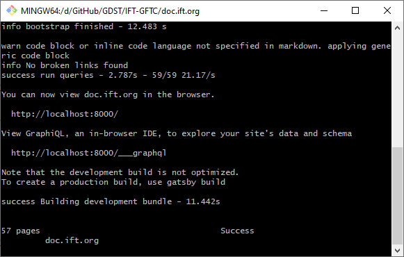

This is a quick tutorial on how to run the Gatsby Server locally. This assumes that you have already cloned the repository to your local computer.

## Install GitBash

+ [Windows](https://gitforwindows.org/)
+ [Linux](https://git-scm.com/downloads)
+ [Mac](https://git-scm.com/downloads)

## Install NodeJS LTS
Make sure to download the Longtime Support Version (LTS).

[Download Here](https://nodejs.org/en/download/)

## Open GitBash
You will need to open GitBash to your local repository directory. This can be done easily in Windows by navigating to the directory in the File Explorer and right clicking and selecting `GitBash Here`

## Install NPM

Type `npm install` to make sure all required packages are installed correctly.

## Run the Gatsby Server

Type `npm run dev` to start the server. Once you see the `Success` status in the command prompt you can navigate to [http://localhost:8000](http://localhost:8000) to see the website running locally.

