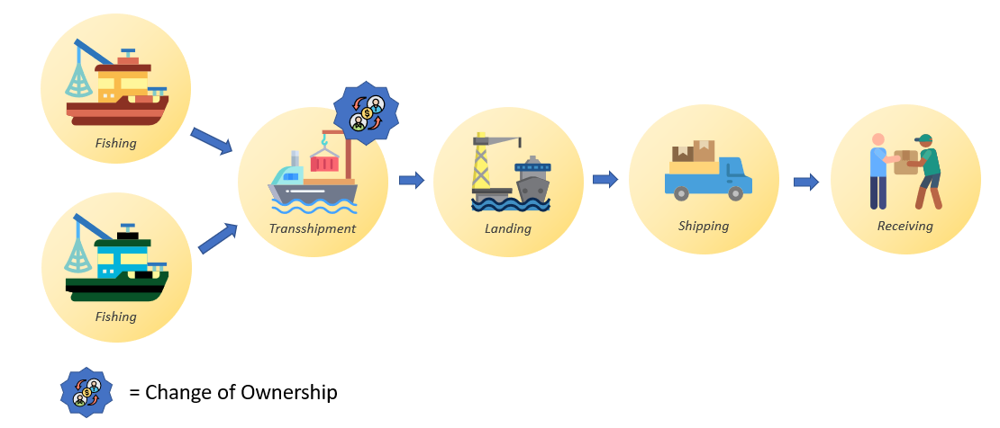

# Details
A couple of details about this scenario:
* This data will be recorded by the processor.
* The processor is the First Receiver, and will take ownership of the products during the transshipment event.
* Although the illustration shows a single Transshipment icon, technically two transshipment events will take place, one for each fishing vessel.
* We will use Non-GS1 Identifiers for all of the locations except the processing plant.
* Because the processor is the one recording the data, we can use the same product definition for both fishing events, because the processor can ensure unique lot numbers. In the event, that a fisherman was recording their own data, they would need to use seperate GTINs in order to ensure no collisions on the lot numbers.

# Master Data
In order to model this scenario we will need the following master data:
* Product Definitions
    - Raw Tuna
* Locations
    - Fishing Vessel #1 (owned by Fisherman #1)
    - Fishing Vessel #2 (owned by Fisherman #2)
    - Transshipment Vessel #1 (owned by Transshipment Company)
    - Port of San Diego (managed by Tuna Processor)
    - Tuna Processing Plant (owned by Tuna Processor)
* Trading Parties
    - Fisherman #1
    - Fisherman #2
    - Transshipment Company
    - Tuna Processor

# XML
```
<?xml version="1.0" encoding="UTF-8"?>
<epcis:EPCISDocument
    xmlns:epcis="urn:epcglobal:epcis:xsd:1"
    xmlns:xsi="http://www.w3.org/2001/XMLSchema-instance"
    xmlns:sbdh="http://www.unece.org/cefact/namespaces/StandardBusinessDocumentHeader"
    xmlns:cbvmda="urn:epcglobal:cbv:mda"
    xmlns:gdst="https://traceability-dialogue.org/epcis" schemaVersion="0" creationDate="2001-12-17T09:30:47Z" xsi:schemaLocation="urn:epcglobal:epcis:xsd:1  http://www.gs1si.org/BMS/epcis/1_2/EPCglobal-epcis-1_2.xsd">
    <EPCISHeader>
        <sbdh:StandardBusinessDocumentHeader>
            <sbdh:HeaderVersion>1.0</sbdh:HeaderVersion>
            <sbdh:Sender>
                <sbdh:Identifier>test</sbdh:Identifier>
                <sbdh:ContactInformation>
                    <sbdh:Contact>test</sbdh:Contact>
                    <sbdh:EmailAddress>test@test.com</sbdh:EmailAddress>
                </sbdh:ContactInformation>
            </sbdh:Sender>
            <sbdh:Receiver>
                <sbdh:Identifier>test</sbdh:Identifier>
                <sbdh:ContactInformation>
                    <sbdh:Contact>test</sbdh:Contact>
                    <sbdh:EmailAddress>test@test.com</sbdh:EmailAddress>
                </sbdh:ContactInformation>
            </sbdh:Receiver>
            <sbdh:DocumentIdentification>
                <sbdh:Standard>GS1</sbdh:Standard>
                <sbdh:TypeVersion>3.0</sbdh:TypeVersion>
                <sbdh:InstanceIdentifier>9999</sbdh:InstanceIdentifier>
                <sbdh:Type>Seafood Traceability</sbdh:Type>
                <sbdh:MultipleType>false</sbdh:MultipleType>
                <sbdh:CreationDateAndTime>2021-09-28T15:30:44.758-03:00</sbdh:CreationDateAndTime>
            </sbdh:DocumentIdentification>
        </sbdh:StandardBusinessDocumentHeader>
        <extension>
            <EPCISMasterData>
                <VocabularyList>
                    <Vocabulary type="urn:epcglobal:epcis:vtype:EPCClass">
                        <VocabularyElementList>
                            <VocabularyElement id="urn:epc:idpat:sgtin:08600031303.00">
                                <attribute id="urn:epcglobal:cbv:mda#descriptionShort">Raw Tuna</attribute>
                                <attribute id="urn:epcglobal:cbv:mda#speciesForFisheryStatisticsPurposesName">YFT</attribute>
                                <attribute id="urn:epcglobal:cbv:mda#additionalTradeItemIdentification">WHL</attribute>
                            </VocabularyElement>
                        </VocabularyElementList>
                    </Vocabulary>
                    <Vocabulary type="urn:epcglobal:epcis:vtype:Location">
                        <VocabularyElementList>
                            <VocabularyElement id="urn:gdst:example.org:location:loc:fisherman01.1">
                                <attribute id="urn:epcglobal:cbv:mda#name">Fishing Vessel #1</attribute>
                                <attribute id="urn:epcglobal:cbv:mda#state">CA</attribute>
                                <attribute id="urn:epcglobal:cbv:mda#countryCode">US</attribute>
                                <attribute id="urn:epcglobal:cbv:mda#vesselID">FV-001</attribute>
                                <attribute id="urn:epcglobal:cbv:mda#imoNumber">IMO00000001</attribute>
                                <attribute id="urn:epcglobal:cbv:mda#vesselFlagState">US</attribute>
                            </VocabularyElement>
                            <VocabularyElement id="urn:gdst:example.org:location:loc:fisherman02.1">
                                <attribute id="urn:epcglobal:cbv:mda#name">Fishing Vessel #2</attribute>
                                <attribute id="urn:epcglobal:cbv:mda#state">CA</attribute>
                                <attribute id="urn:epcglobal:cbv:mda#countryCode">US</attribute>
                                <attribute id="urn:epcglobal:cbv:mda#vesselID">FV-002</attribute>
                                <attribute id="urn:epcglobal:cbv:mda#imoNumber">IMO00000002</attribute>
                                <attribute id="urn:epcglobal:cbv:mda#vesselFlagState">US</attribute>
                            </VocabularyElement>
                            <VocabularyElement id="urn:gdst:example.org:location:loc:transshipment_company.1">
                                <attribute id="urn:epcglobal:cbv:mda#name">Transshipment Vessel</attribute>
                                <attribute id="urn:epcglobal:cbv:mda#state">CA</attribute>
                                <attribute id="urn:epcglobal:cbv:mda#countryCode">US</attribute>
                                <attribute id="urn:epcglobal:cbv:mda#vesselID">TV-001</attribute>
                                <attribute id="urn:epcglobal:cbv:mda#imoNumber">IMO00000003</attribute>
                                <attribute id="urn:epcglobal:cbv:mda#vesselFlagState">US</attribute>
                            </VocabularyElement>
                            <VocabularyElement id="urn:gdst:example.org:location:loc:tuna_processor.port_san_diego">
                                <attribute id="urn:epcglobal:cbv:mda#name">Port of San Diego</attribute>
                                <attribute id="urn:epcglobal:cbv:mda#state">CA</attribute>
                                <attribute id="urn:epcglobal:cbv:mda#countryCode">US</attribute>
                            </VocabularyElement>
                            <VocabularyElement id="urn:epc:id:sgln:08600031303.1.0">
                                <attribute id="urn:epcglobal:cbv:mda#name">Tuna Processing Plant</attribute>
                                <attribute id="urn:epcglobal:cbv:mda#streetAddressOne">6461 El Apajo</attribute>
                                <attribute id="urn:epcglobal:cbv:mda#city">Rancho Santa Fe</attribute>
                                <attribute id="urn:epcglobal:cbv:mda#state">CA</attribute>
                                <attribute id="urn:epcglobal:cbv:mda#countryCode">US</attribute>
                            </VocabularyElement>
                        </VocabularyElementList>
                    </Vocabulary>
                    <Vocabulary type="urn:epcglobal:epcis:vtype:TradingParty">
                        <VocabularyElementList>
                            <VocabularyElement id="urn:gdst:example.org:party:fisherman01.0">
                                <attribute id="urn:epcglobal:cbv:mda#name">Fisherman #1</attribute>
                            </VocabularyElement>
                            <VocabularyElement id="urn:gdst:example.org:party:fisherman02.0">
                                <attribute id="urn:epcglobal:cbv:mda#name">Fisherman #2</attribute>
                            </VocabularyElement>
                            <VocabularyElement id="urn:gdst:example.org:party:transshipment_companny.0">
                                <attribute id="urn:epcglobal:cbv:mda#name">Transshipment Company</attribute>
                            </VocabularyElement>
                            <VocabularyElement id="urn:epc:id:sgln:08600031303.0.0">
                                <attribute id="urn:epcglobal:cbv:mda#name">Tuna Processor</attribute>
                            </VocabularyElement>
                        </VocabularyElementList>
                    </Vocabulary>
                </VocabularyList>
            </EPCISMasterData>
        </extension>
    </EPCISHeader>
    <EPCISBody>
        <EventList>
            <ObjectEvent>
                <eventTime>2021-09-28T13:37:42.255Z</eventTime>
                <eventTimeZoneOffset>+00:00</eventTimeZoneOffset>
                <baseExtension>
                    <eventID>326063c1-bf9f-4c78-892e-ca8897297e78</eventID>
                </baseExtension>
                <epcList/>
                <action>ADD</action>
                <bizStep>urn:gdst:bizStep:fishingEvent</bizStep>
                <disposition>urn:epcglobal:cbv:disp:active</disposition>
                <readPoint>
                    <id/>
                </readPoint>
                <bizLocation>
                    <id>urn:gdst:example.org:location:loc:fisherman02.1</id>
                </bizLocation>
                <extension>
                    <quantityList>
                        <quantityElement>
                            <epcClass>urn:epc:class:lgtin:08600031303.00.L001</epcClass>
                            <quantity>10000</quantity>
                            <uom>KGM</uom>
                        </quantityElement>
                    </quantityList>
                    <ilmd>
                        <cbvmda:vesselCatchInformationList>
                            <cbvmda:vesselCatchInformation>
                                <cbvmda:vesselName>Fishing Vessel #2</cbvmda:vesselName>
                                <cbvmda:vesselID>FV-002</cbvmda:vesselID>
                                <gdst:imoNumber>IMO00000002</gdst:imoNumber>
                                <cbvmda:vesselFlagState>US</cbvmda:vesselFlagState>
                                <gdst:vesselPublicRegistry/>
                                <gdst:gpsAvailability/>
                                <gdst:satelliteTrackingAuthority/>
                                <cbvmda:economicZone/>
                                <gdst:fisheryImprovementProject/>
                                <gdst:rfmoArea/>
                                <gdst:subnationalPermitArea/>
                                <cbvmda:catchArea>urn:gdst:fao:77</cbvmda:catchArea>
                                <cbvmda:fishingGearTypeCode>urn:gdst:gear:1.2</cbvmda:fishingGearTypeCode>
                            </cbvmda:vesselCatchInformation>
                        </cbvmda:vesselCatchInformationList>
                        <cbvmda:harvestEndDate>2021-09-30T03:00:00.000Z</cbvmda:harvestEndDate>
                        <cbvmda:harvestStartDate>2021-09-27T03:00:00.000Z</cbvmda:harvestStartDate>
                        <cbvmda:certificationList>
                            <certification>
                                <gdst:certificationType>urn:gdst:certType:fishingAuth</gdst:certificationType>
                                <certificationStandard>San Diego Fishing Authority</certificationStandard>
                                <certificationAgency>San Diego Fishing Authority</certificationAgency>
                                <certificationValue/>
                                <certificationIdentification>SDFA-1001</certificationIdentification>
                            </certification>
                            <certification>
                                <gdst:certificationType>urn:gdst:certType:harvestCert</gdst:certificationType>
                                <certificationStandard>San Diego Fishing Authority</certificationStandard>
                                <certificationAgency>San Diego Fishing Authority</certificationAgency>
                                <certificationValue/>
                                <certificationIdentification>SDFA-1001</certificationIdentification>
                            </certification>
                            <certification>
                                <gdst:certificationType>urn:gdst:certType:humanPolicy</gdst:certificationType>
                                <certificationStandard>San Diego Fishing Authority</certificationStandard>
                                <certificationAgency>San Diego Fishing Authority</certificationAgency>
                                <certificationValue/>
                                <certificationIdentification>SDFA-1001</certificationIdentification>
                            </certification>
                        </cbvmda:certificationList>
                    </ilmd>
                </extension>
                <gdst:productOwner>urn:gdst:example.org:party:fisherman02.0</gdst:productOwner>
                <cbvmda:informationProvider>urn:epc:id:sgln:08600031303.0.0</cbvmda:informationProvider>
            </ObjectEvent>
            <ObjectEvent>
                <eventTime>2021-09-28T19:00:00.000Z</eventTime>
                <eventTimeZoneOffset>+00:00</eventTimeZoneOffset>
                <baseExtension>
                    <eventID>a10678f8-9a1a-491a-b77d-1e9ddf7a30fa</eventID>
                </baseExtension>
                <epcList/>
                <action>OBSERVE</action>
                <bizStep>urn:gdst:bizStep:transshipment</bizStep>
                <disposition>urn:epcglobal:cbv:disp:active</disposition>
                <readPoint>
                    <id>geo:0,0</id>
                </readPoint>
                <bizLocation>
                    <id>urn:gdst:example.org:location:loc:transshipment_company.1</id>
                </bizLocation>
                <extension>
                    <quantityList>
                        <quantityElement>
                            <epcClass>urn:epc:class:lgtin:08600031303.00.L001</epcClass>
                            <quantity>10000</quantity>
                            <uom>KGM</uom>
                        </quantityElement>
                    </quantityList>
                    <destinationList>
                        <destination type="urn:epcglobal:cbv:sdt:owning_party">urn:epc:id:sgln:08600031303.0.0</destination>
                    </destinationList>
                </extension>
                <cbvmda:transshipStartDate>2021-09-28T03:00:00.000Z</cbvmda:transshipStartDate>
                <cbvmda:transshipEndDate>2021-09-28T03:00:00.000Z</cbvmda:transshipEndDate>
                <cbvmda:certificationList>
                    <certification>
                        <gdst:certificationType>urn:gdst:certType:transshipmentAuth</gdst:certificationType>
                        <certificationStandard>San Diego Transshipment Authorization</certificationStandard>
                        <certificationAgency>San Diego Transshipment Authorization</certificationAgency>
                        <certificationValue/>
                        <certificationIdentification>SDTA-1001</certificationIdentification>
                    </certification>
                    <certification>
                        <gdst:certificationType>urn:gdst:certType:harvestCoC</gdst:certificationType>
                        <certificationStandard>San Diego Transshipment Authorization</certificationStandard>
                        <certificationAgency>San Diego Transshipment Authorization</certificationAgency>
                        <certificationValue/>
                        <certificationIdentification>SDTA-1001</certificationIdentification>
                    </certification>
                    <certification>
                        <gdst:certificationType>urn:gdst:certType:humanPolicy</gdst:certificationType>
                        <certificationStandard>San Diego Transshipment Authorization</certificationStandard>
                        <certificationAgency>San Diego Transshipment Authorization</certificationAgency>
                        <certificationValue/>
                        <certificationIdentification>SDTA-1001</certificationIdentification>
                    </certification>
                </cbvmda:certificationList>
                <gdst:productOwner>urn:epc:id:sgln:08600031303.0.0</gdst:productOwner>
                <cbvmda:informationProvider>urn:epc:id:sgln:08600031303.0.0</cbvmda:informationProvider>
            </ObjectEvent>
            <ObjectEvent>
                <eventTime>2021-09-29T13:37:40.718Z</eventTime>
                <eventTimeZoneOffset>+00:00</eventTimeZoneOffset>
                <baseExtension>
                    <eventID>48b58551-790e-4102-8bfa-ede9f5421564</eventID>
                </baseExtension>
                <epcList/>
                <action>ADD</action>
                <bizStep>urn:gdst:bizStep:fishingEvent</bizStep>
                <disposition>urn:epcglobal:cbv:disp:active</disposition>
                <readPoint>
                    <id/>
                </readPoint>
                <bizLocation>
                    <id>urn:gdst:example.org:location:loc:fisherman01.1</id>
                </bizLocation>
                <extension>
                    <quantityList>
                        <quantityElement>
                            <epcClass>urn:epc:class:lgtin:08600031303.00.L002</epcClass>
                            <quantity>10000</quantity>
                            <uom>KGM</uom>
                        </quantityElement>
                    </quantityList>
                    <ilmd>
                        <cbvmda:vesselCatchInformationList>
                            <cbvmda:vesselCatchInformation>
                                <cbvmda:vesselName>Fishing Vessel #1</cbvmda:vesselName>
                                <cbvmda:vesselID>FV-001</cbvmda:vesselID>
                                <gdst:imoNumber>IMO00000001</gdst:imoNumber>
                                <cbvmda:vesselFlagState>US</cbvmda:vesselFlagState>
                                <gdst:vesselPublicRegistry/>
                                <gdst:gpsAvailability/>
                                <gdst:satelliteTrackingAuthority/>
                                <cbvmda:economicZone/>
                                <gdst:fisheryImprovementProject/>
                                <gdst:rfmoArea/>
                                <gdst:subnationalPermitArea/>
                                <cbvmda:catchArea>urn:gdst:fao:77</cbvmda:catchArea>
                                <cbvmda:fishingGearTypeCode>urn:gdst:gear:1.2</cbvmda:fishingGearTypeCode>
                            </cbvmda:vesselCatchInformation>
                        </cbvmda:vesselCatchInformationList>
                        <cbvmda:harvestEndDate>2021-09-30T03:00:00.000Z</cbvmda:harvestEndDate>
                        <cbvmda:harvestStartDate>2021-09-26T03:00:00.000Z</cbvmda:harvestStartDate>
                        <cbvmda:certificationList>
                            <certification>
                                <gdst:certificationType>urn:gdst:certType:fishingAuth</gdst:certificationType>
                                <certificationStandard>San Diego Fishing Authority</certificationStandard>
                                <certificationAgency>San Diego Fishing Authority</certificationAgency>
                                <certificationValue/>
                                <certificationIdentification>SDFA-1002</certificationIdentification>
                            </certification>
                            <certification>
                                <gdst:certificationType>urn:gdst:certType:harvestCert</gdst:certificationType>
                                <certificationStandard>San Diego Fishing Authority</certificationStandard>
                                <certificationAgency>San Diego Fishing Authority</certificationAgency>
                                <certificationValue/>
                                <certificationIdentification>SDFA-1002</certificationIdentification>
                            </certification>
                            <certification>
                                <gdst:certificationType>urn:gdst:certType:humanPolicy</gdst:certificationType>
                                <certificationStandard>San Diego Fishing Authority</certificationStandard>
                                <certificationAgency>San Diego Fishing Authority</certificationAgency>
                                <certificationValue/>
                                <certificationIdentification>SDFA-1002</certificationIdentification>
                            </certification>
                        </cbvmda:certificationList>
                    </ilmd>
                </extension>
                <gdst:productOwner>urn:gdst:example.org:party:fisherman01.0</gdst:productOwner>
                <cbvmda:informationProvider>urn:epc:id:sgln:08600031303.0.0</cbvmda:informationProvider>
            </ObjectEvent>
            <ObjectEvent>
                <eventTime>2021-09-30T13:37:45.892Z</eventTime>
                <eventTimeZoneOffset>+00:00</eventTimeZoneOffset>
                <baseExtension>
                    <eventID>d4180aff-0db7-4c02-bf2b-579185253819</eventID>
                </baseExtension>
                <epcList/>
                <action>OBSERVE</action>
                <bizStep>urn:gdst:bizStep:transshipment</bizStep>
                <disposition>urn:epcglobal:cbv:disp:active</disposition>
                <readPoint>
                    <id>geo:0,0</id>
                </readPoint>
                <bizLocation>
                    <id>urn:gdst:example.org:location:loc:transshipment_company.1</id>
                </bizLocation>
                <extension>
                    <quantityList>
                        <quantityElement>
                            <epcClass>urn:epc:class:lgtin:08600031303.00.L002</epcClass>
                            <quantity>10000</quantity>
                            <uom>KGM</uom>
                        </quantityElement>
                    </quantityList>
                    <destinationList>
                        <destination type="urn:epcglobal:cbv:sdt:owning_party">urn:epc:id:sgln:08600031303.0.0</destination>
                    </destinationList>
                </extension>
                <cbvmda:certificationList>
                    <certification>
                        <gdst:certificationType>urn:gdst:certType:transshipmentAuth</gdst:certificationType>
                        <certificationStandard>San Diego Transshipment Authorization</certificationStandard>
                        <certificationAgency>San Diego Transshipment Authorization</certificationAgency>
                        <certificationValue/>
                        <certificationIdentification>SDTA-1001</certificationIdentification>
                    </certification>
                    <certification>
                        <gdst:certificationType>urn:gdst:certType:harvestCoC</gdst:certificationType>
                        <certificationStandard>San Diego Transshipment Authorization</certificationStandard>
                        <certificationAgency>San Diego Transshipment Authorization</certificationAgency>
                        <certificationValue/>
                        <certificationIdentification>SDTA-1001</certificationIdentification>
                    </certification>
                    <certification>
                        <gdst:certificationType>urn:gdst:certType:humanPolicy</gdst:certificationType>
                        <certificationStandard>San Diego Transshipment Authorization</certificationStandard>
                        <certificationAgency>San Diego Transshipment Authorization</certificationAgency>
                        <certificationValue/>
                        <certificationIdentification>SDTA-1001</certificationIdentification>
                    </certification>
                </cbvmda:certificationList>
                <gdst:productOwner>urn:epc:id:sgln:08600031303.0.0</gdst:productOwner>
                <cbvmda:informationProvider>urn:epc:id:sgln:08600031303.0.0</cbvmda:informationProvider>
            </ObjectEvent>
            <ObjectEvent>
                <eventTime>2021-10-01T13:37:52.361Z</eventTime>
                <eventTimeZoneOffset>+00:00</eventTimeZoneOffset>
                <baseExtension>
                    <eventID>c56248c5-14bf-4d74-8c51-2e98fefac53f</eventID>
                </baseExtension>
                <epcList/>
                <action>OBSERVE</action>
                <bizStep>urn:gdst:bizStep:landing</bizStep>
                <disposition>urn:epcglobal:cbv:disp:active</disposition>
                <readPoint>
                    <id>geo:0,0</id>
                </readPoint>
                <bizLocation>
                    <id>urn:gdst:example.org:location:loc:tuna_processor.port_san_diego</id>
                </bizLocation>
                <extension>
                    <quantityList>
                        <quantityElement>
                            <epcClass>urn:epc:class:lgtin:08600031303.00.L001</epcClass>
                            <quantity>10000</quantity>
                            <uom>KGM</uom>
                        </quantityElement>
                        <quantityElement>
                            <epcClass>urn:epc:class:lgtin:08600031303.00.L002</epcClass>
                            <quantity>10000</quantity>
                            <uom>KGM</uom>
                        </quantityElement>
                    </quantityList>
                </extension>
                <cbvmda:certificationList>
                    <certification>
                        <gdst:certificationType>urn:gdst:certType:landingAuth</gdst:certificationType>
                        <certificationStandard>San Diego Landing Authority</certificationStandard>
                        <certificationAgency>San Diego Landing Authority</certificationAgency>
                        <certificationValue/>
                        <certificationIdentification>SDLA-001</certificationIdentification>
                    </certification>
                    <certification>
                        <gdst:certificationType>urn:gdst:certType:humanPolicy</gdst:certificationType>
                        <certificationStandard>San Diego Landing Authority</certificationStandard>
                        <certificationAgency>San Diego Landing Authority</certificationAgency>
                        <certificationValue/>
                        <certificationIdentification>SDLA-001</certificationIdentification>
                    </certification>
                </cbvmda:certificationList>
                <gdst:productOwner>urn:epc:id:sgln:08600031303.0.0</gdst:productOwner>
                <cbvmda:informationProvider>urn:epc:id:sgln:08600031303.0.0</cbvmda:informationProvider>
            </ObjectEvent>
            <ObjectEvent>
                <eventTime>2021-10-01T16:30:00.000Z</eventTime>
                <eventTimeZoneOffset>+00:00</eventTimeZoneOffset>
                <baseExtension>
                    <eventID>17245baf-045b-4dbc-a3a2-c547ec8f8e31</eventID>
                </baseExtension>
                <epcList/>
                <action>OBSERVE</action>
                <bizStep>urn:epcglobal:cbv:bizstep:shipping</bizStep>
                <disposition>urn:epcglobal:cbv:disp:active</disposition>
                <readPoint>
                    <id/>
                </readPoint>
                <bizLocation>
                    <id>urn:gdst:example.org:location:loc:tuna_processor.port_san_diego</id>
                </bizLocation>
                <extension>
                    <quantityList>
                        <quantityElement>
                            <epcClass>urn:epc:class:lgtin:08600031303.00.L002</epcClass>
                            <quantity>10000</quantity>
                            <uom>KGM</uom>
                        </quantityElement>
                        <quantityElement>
                            <epcClass>urn:epc:class:lgtin:08600031303.00.L001</epcClass>
                            <quantity>10000</quantity>
                            <uom>KGM</uom>
                        </quantityElement>
                    </quantityList>
                </extension>
                <cbvmda:certificationList>
                    <certification>
                        <gdst:certificationType>urn:gdst:certType:harvestCoC</gdst:certificationType>
                        <certificationStandard/>
                        <certificationAgency/>
                        <certificationValue/>
                        <certificationIdentification/>
                    </certification>
                </cbvmda:certificationList>
                <gdst:productOwner>urn:epc:id:sgln:08600031303.0.0</gdst:productOwner>
                <cbvmda:informationProvider>urn:epc:id:sgln:08600031303.0.0</cbvmda:informationProvider>
            </ObjectEvent>
            <ObjectEvent>
                <eventTime>2021-10-01T22:00:00.000Z</eventTime>
                <eventTimeZoneOffset>+00:00</eventTimeZoneOffset>
                <baseExtension>
                    <eventID>f7fd7f10-1653-4541-bc33-0fcd6ab54303</eventID>
                </baseExtension>
                <epcList/>
                <action>OBSERVE</action>
                <bizStep>urn:epcglobal:cbv:bizstep:receiving</bizStep>
                <disposition>urn:epcglobal:cbv:disp:active</disposition>
                <readPoint>
                    <id/>
                </readPoint>
                <bizLocation>
                    <id>urn:epc:id:sgln:08600031303.1.0</id>
                </bizLocation>
                <extension>
                    <quantityList>
                        <quantityElement>
                            <epcClass>urn:epc:class:lgtin:08600031303.00.L001</epcClass>
                            <quantity>10000</quantity>
                            <uom>KGM</uom>
                        </quantityElement>
                        <quantityElement>
                            <epcClass>urn:epc:class:lgtin:08600031303.00.L002</epcClass>
                            <quantity>10000</quantity>
                            <uom>KGM</uom>
                        </quantityElement>
                    </quantityList>
                </extension>
                <cbvmda:certificationList>
                    <certification>
                        <gdst:certificationType>urn:gdst:certType:harvestCoC</gdst:certificationType>
                        <certificationStandard/>
                        <certificationAgency/>
                        <certificationValue/>
                        <certificationIdentification/>
                    </certification>
                </cbvmda:certificationList>
                <gdst:productOwner>urn:epc:id:sgln:08600031303.0.0</gdst:productOwner>
                <cbvmda:informationProvider>urn:epc:id:sgln:08600031303.0.0</cbvmda:informationProvider>
            </ObjectEvent>
        </EventList>
    </EPCISBody>
</epcis:EPCISDocument>
```


